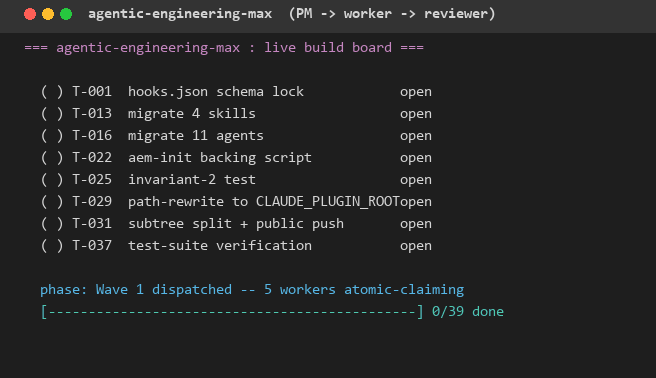

# agentic-engineering-max

Plan, build, review: a multi-agent engineering toolkit for Claude Code projects.

`agentic-engineering-max` (slug `aem`) packages a proven build system into a single Claude Code plugin. It ships a scientific-method plan interviewer, a 3-department implementation system (Project Management + atomic-claim workers + epistemic-panel reviewers), and state-surface discipline (auto-written `plan-state.md` + `README.md` mirror + pre-commit and drift hooks).

The discipline this plugin packages was developed across multiple real builds before being extracted; every principle has a battle scar behind it.



## Quick install

```text
/plugin marketplace add GhostlyGawd/agentic-engineering-max
/plugin install agentic-engineering-max@agentic-engineering-max
```

Then in any project where you want to use it:

```text
/aem-init
```

`/aem-init` wires the plugin's git pre-commit hook into your repo (via `git config core.hooksPath`) and prints a next-action summary. SessionStart and SessionEnd hooks fire automatically once the plugin is installed.

## What it does (concepts)

Three departments cooperate on every build:

- **Plan Interviewer** asks one question at a time and reaches 100% understanding before any work begins. The interview produces a versioned `plan-ledger.md` and a mutable `plan-state.md` state surface.
- **PRD Writer + Spec Writer** convert the locked plan into an engineering-grade PRD and an implementation spec broken into atomically-claimable tasks with explicit dependencies.
- **PM + Worker + Reviewer** run the build. Workers claim tasks (one at a time, via per-task `.lock` files), commit, and hand off to reviewers. Reviewers spawn a panel of epistemic stances (Pragmatist, Falsificationist, Hermeneut, Bayesian by default), synthesize a verdict, and either pass or send back for revision.

State-surface discipline keeps `plan-state.md` + your repo `README.md` honest: hooks auto-write current state at SessionEnd, a UserPromptSubmit drift detector surfaces ledger-vs-state gaps, and a git pre-commit hook blocks ledger-only commits.

## Operating model: PM -> worker -> reviewer

Three terminals run in parallel:

1. **Orchestrator** (your main Claude Code session) -- drafts the plan, dispatches PM/workers/reviewers.
2. **PM terminal** -- `/loop 30s /pm <slug>` keeps the task board fresh, sweeps stale locks, surfaces escalations.
3. **Worker terminal(s)** -- each `/loop /worker <slug>` is one worker. Set `$env:WORKER_ID = 'worker-A'` before launching so commits and locks attribute correctly. A worker grinds 5 tasks per session, writes a handoff file, and stops.

Reviewers run on demand: `/reviewer <slug>` claims any `in_review` task, runs the epistemic panel, and either marks the task `done` or sends it back as `needs_fixing` for the original worker to address (up to 3 iterations before automatic escalation).

## Troubleshooting

- **Worker stalls on a permission prompt.** Workers are intended for unattended operation. Launch the worker terminal with `--dangerously-skip-permissions` if you trust the build, or pre-allowlist the tool patterns you want via `~/.claude/settings.json`.
- **Lock file left behind after closing a worker mid-task.** PM auto-sweeps stale locks after 30 minutes (configurable via `planning/<slug>/.build-config.json` -> `stale_lock_minutes`). To force-release immediately: `/unblock <task-id>`.
- **State drift warning on every turn.** The drift hook compares `plan-ledger.md` against `plan-state.md` and yells when they disagree. Fix by re-running the relevant phase-owning agent (interviewer, PRD writer, spec writer, wave-closer) which updates state as part of its Definition of Done.
- **`/aem-init` says "no git repo found".** Run `git init` first. The plugin's pre-commit hook needs a git repo to attach to.
- **Pre-commit hook blocks a commit you want to make.** The hook only blocks commits that touch `plan-ledger.md` without also touching `plan-state.md` (state-mirror enforcement). Stage both files or amend your edit to include the matching state update.

## Scope and limits

**v1 targets Windows 10/11 + PowerShell 5.1 (or later) + Git for Windows.** This is a STAGED commitment, not a permanent limit. The system is built for cross-platform v2 once adoption signal justifies the port -- see `STAGED-ROADMAP.md` for the threshold.

Non-Windows installs trigger a graceful refusal at `/aem-init` time with a pointer to the v2 roadmap issue. The plugin will not silently malfunction on macOS or Linux; it explicitly tells you it is not yet supported.

What this plugin is NOT:

- Not a project scaffolder (it adds discipline to an existing repo; it does not create one for you).
- Not a CI runner.
- Not an LLM-as-a-service wrapper (it runs inside your Claude Code session; no separate API key is set up).
- Not a replacement for code review tools like CodeRabbit or GitHub PR review -- it complements them by reviewing inside the build loop, before code lands.

See STAGED-ROADMAP.md for the v2 cross-platform commitment and adoption threshold.

## Prerequisites

- Windows 10 or 11
- PowerShell 5.1 (built-in) or PowerShell 7+
- Git for Windows
- Claude Code CLI (`claude`)

## Uninstall

```text
/plugin uninstall agentic-engineering-max
```

Then, in any repo where you ran `/aem-init`, run:

```text
git config --unset core.hooksPath
```

This reverses the pre-commit hook wiring. The plugin never modifies your `CLAUDE.md`, your `~/.claude/settings.json`, or any other operator file -- so uninstall is a clean operation.

## License

MIT. See [LICENSE](./LICENSE).

## Contributing

See [CONTRIBUTING.md](./CONTRIBUTING.md).
